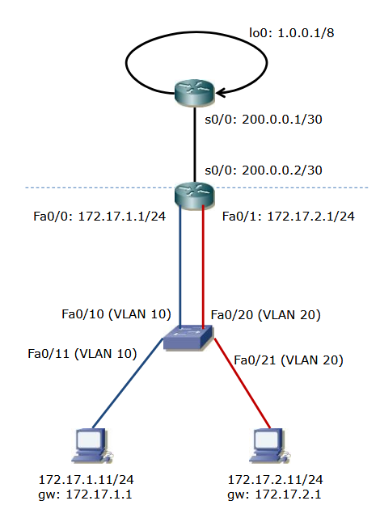

### Zadanie 1

Konfigurujemy topologię tak jak na rysunku poniżej:


kabelki podłączone jak na zdjęciu poniżej:


ustawinie switcha:

```bash
enable
config t
interface fa0/10
switchport mode access
switchport access vlan 10
exit
interface fa0/11
switchport mode access
switchport access vlan 10
exit
interface fa0/20
switchport mode access
switchport access vlan 20
exit
interface fa0/21
switchport mode access
switchport access vlan 20
exit
```

ustawienie adresów na routerze (tym bez loopbacka):

```bash
enable
config t
interface fa0/0
ip address 172.17.1.1 255.255.255.0
no shutdown
exit
interface fa0/1
ip address 172.17.2.1 255.255.255.0
no shutdown
exit
interface s0/0
ip address 200.0.0.2 255.255.255.252
clock rate 64000 # to tylko jeśli korzystamy z serial (tu w przykładzie s0/0), na zajęciach korzystaliśmy z g/0/0/0 to wtedy nie trzeba
no shutdown
end
```

ustawienie adresów na routerze z loopbackiem:

```bash
enable
config t
interface s0/0
ip address 200.0.0.1 255.255.255.252
clock rate 64000 # to samo co wyżej z serialem
no shutdown
interface loopback 0
ip address 1.0.0.1 255.0.0.0
```

ustawienie tras na routerze bez loopbacka:

```bash
enable
config t
ip route 0.0.0.0 0.0.0.0 200.0.0.1
end
```

ustawienie tras na routerze z loopbackiem:

```bash
enable
config t
ip route 172.17.1.0 255.255.255.0 200.0.0.2
ip route 172.17.2.0 255.255.255.0 200.0.0.2
```

tu wypada pingnac zeby sprawdzic czy wszystko dziala

ustawienie nat na routerze bez loopbacka:

```bash
enable
config t
interface fa0/0
ip nat inside
exit
interface fa0/1
ip nat inside
exit
interface s0/0
ip nat outside
exit
access-list 1 permit any
ip nat inside source list 1 interface s0/0 overload
end
```

sprawdzenie nata:

```bash
show ip nat translations
show ip nat statistics
```

na routerze z loopbackiem:

```bash
conf t
username Q password BA
ip http server
ip http authentication local
```
