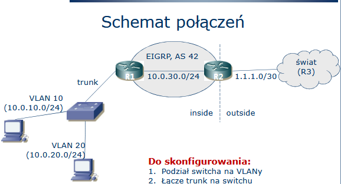

STP, VLANy, EIGRP, połączenie do świata

## Realizacja ćwiczenia

STP, VLANy, EIGRP, połączenie do świata

### Połączenia

STP, VLANy, EIGRP, połączenie do świata

#### Konfiguracja Switchy - STP:

Na obu switchach:
en
conf t
int range fa0/1 - 2
channel-group 1 mode desirable
end

    Na nowym porcie grupy, który powstał (Po1) ustawiamy trunk:
    en
    conf t
    int po1
        switchport mode trunk
    end

    Na switchu S2 ustawiamy połączenie trunk do routera R1
    Na routerze R1 ustawiamy połączenie trunk do switcha S2:
    en
    conf t
    int Gi0/0/1.10
        encapsulation dot1q 10
        ip address 10.0.10.1 255.255.255.0
        no shutdown
        exit
    int Gi0/0/1.20
        encapsulation dot1q 20
        ip address 10.0.20.1 255.255.255.0
        no shutdown
        exit
    int Gi0/0/1
        no shutdown
        end

#### Konfiguracja VLANów na switchach:

Na obu switchach:
en
conf t
vlan 10
name VLAN10
exit
int fa0/1
switchport mode access
switchport access vlan 10
spanning-tree portfast
exit
vlan 20
name VLAN20
exit
int fa0/2
switchport mode access
switchport access vlan 20
spanning-tree portfast
exit
end

    Na switchu S2 sprawdzamy konfigurację VLANów:
    en
    show vlan brief
    nie ma nic, bo nie mamy podłączonych komputerów do switcha
    więc teraz:
    conf t
        VLAN 10
        exit
        VLAN 20
        exit
    end
    show vlan brief
    i teraz już są

#### Konfiguracja komputerów:

setip (taka nasza wewnętrzna komenda) 10.0.x.x 255.255.255.0 10.0.x.1 (brama domyślna)

#### Konfiguracja EIGRP na routerach:

Na obu routerach:
en
conf t
router eigrp 42
network 10.0.30.0 255.255.255.0
exit
end
Konfiguracja połączenia pomiędzy portami Gi0/0/0 na R1 i R2:
Na obu routerach:
en
conf t
int Gi0/0/0
ip address 10.0.30.x 255.255.255.0
no shutdown
exit
end
Na R2:
en
conf t
int Gi0/0/1
ip address 1.1.1.2 255.255.255.252
no shutdown
exit
end
Na R3:
en
conf t
int Fa0/0
ip address 1.1.1.1. 255.255.255.252
no shutdown
exit
end

#### Konfiguracja NAT na R2:

Na R2:
enable
config t
interface fa0/0
description Do sieci lokalnych
ip nat inside
interface s0/0
description Na zewnatrz
ip nat outside
access-list 10 permit 10.0.10.0 0.0.0.255
access-list 20 permit 10.0.20.0. 0.0.0.255

    ip nat pool ROBACZEQ 11.22.33.40 11.22.33.44 prefix-length 24
    ip nat inside source list 10 pool ROBACZEQ overload

    ip nat pool DZDZOWNICZEQ 11.22.33.45 11.22.33.49 prefix-length 24
    ip nat inside source list 20 pool DZDZOWNICZEQ overload
    end
    Well, jednak nie do końca w taki sposób, ale możne zadziałać - teraz na R3 ustawiamy trasy do 11.22.33.0/24
    i na R3:
    en
    conf t
    ip route 11.22.33.0 255.255.255.0 1.1.1.2

    R2 musi jeszcze podać trasę domyślną do R1: (konfiguracja i redystrubucja statycznej trasy do EIGRP)
    en
    conf t
    ip route 0.0.0.0 0.0.0.0 1.1.1.1
    router eigrp 42
    redistribute static metric 10000 1000 255 1 1500

