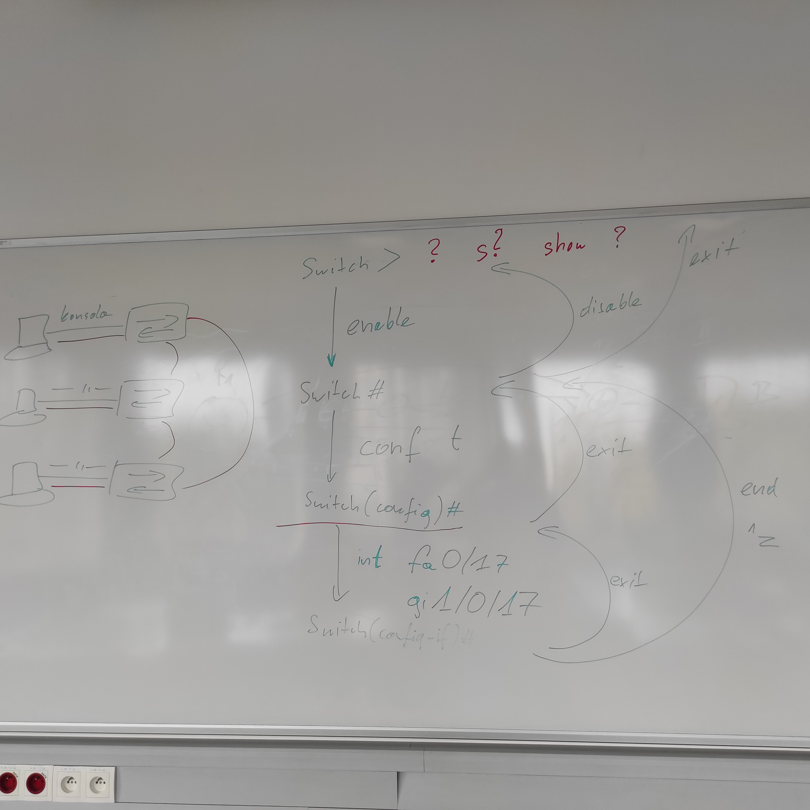

<h1 align="center">Notatki z sieci komputerowych</h1>

<h2 align="center"> Lab 2 </h2>

##### 1. Jak chcemy podpiąć komputer do konsoli to:

- wejście [numerek komputera]C w szafie
- kabelek prosty (niebieski) do switcha konsoli (takie kolorowe w szafie mniej więcej na środku wysokości)
- włączamy putty
- klik 2x na konsolę
  (jest łącze asynchroniczne więc urządzenie nie wie że się do niego podłączyliśmy)
- cyk enterek 2 razy
- potem nie chcemy dialogu ze switchem więc piszemu mu no

##### 2. Komendy opcje i inne bajery:

- "?" to jest pomoc z komendami (pokazuje co robią itd), pokazuje dokumentacje

- np "s?" to sie dowiemy o komendach na litere s

- np "show ?" to sie dowiemy o komendzie show

- jak damy enable to pojawia się przy switch #, to znaczy że jesteśmy ważni (administrator czy cos w tym rodzaju)
- na początku jest switch>, to znaczy że niewiele możemy (jakiś mały nieważny użytkownik)

- conf t -> czyli config terminal
  (pojawia się switch(config))

- int fa0/17 - tutaj możemy konfigurować jak jest więcej urządzeń, bez tego konfigurujemy urządzenia których jest 1 (chyba do sprawdzenia)

- exit - wychodzi do bardziej głownego stanu o 1, end albo ctrl z wychodzi od razu do administratora (switch#)

- polecenie hostname zmienia nazwe hosta
  (teraz zamiast switch jest ta nazwa co sie ją ustawiło)

- show mac-address-table albo show mac address-table - komenda do sprawdzenia adresów mac

##### 3. Podłączanie kabelków

podłączyliśmy komputery do switchy i switche ze sobą (schemat na zdjęciu)

pc z pc (albo router) kabelek z przeplotem (biały)

<figure align="center">
  
  <figcaption><em>Rys. 1 — Schemat połączeń (lab 2)</em></figcaption>
</figure>

##### 4. Wireshark

- 8 bit mówi czy adres jest unicastowy (0) czy nie. On jest 8 z kolei w zapisie ale 1 na kablu ( w sensie bit)

- adres broadcastowy to same 1 (albo same f w 16stkowym)

##### 5. Psucie komputerów na końcu labów:

- ta komenda od sprawdzenia adresów mac
- pingujemy sobie ping -t żeby pingował drugi komputer cały czas i chcemy popsuć:
  - trzeba wejść w tryb konfiguracji portu
  - odpowiednim (chyba adresie mac) wywołać komendę shutdown
- potem po 30s samo się naprawia

<figure align="center">
  
  <figcaption><em>Rys. 2 - Schemat z tablicy </em></figcaption>
</figure>
