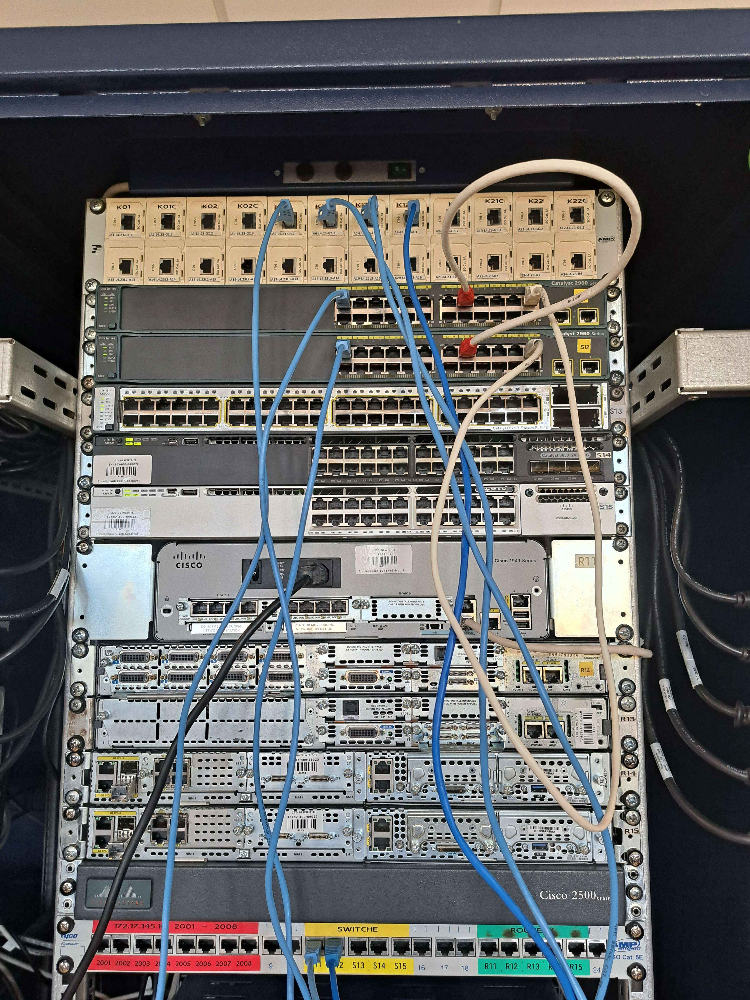

<h1 align="center">Notatki z sieci komputerowych</h1>

<h2 align="center"> Lab 3 </h2>

##### Prelab

Na portach najczęściej definiujemy do którego VLANu przypisane jest urządzenie (sposób statyczny)

Jak się robi to na podstawie adresów MAC to jest sposób dynamiczny, działa to na zasadzie tablicy CAM

VMPS - VLAN Management Policy Server (on robi za tablicę) - dopasowuje adres MAC do konkretnego VLAN

Łącze trunk - łącze które może transportować ramki wielu VLANów

nie można się losowo wpinać do vlan, bo wtedy port się domyślnie wyłączy, trzeba wtedy wołać administratora, bo port wchodzi w stan krytyczny i administrator go musi uruchomić spowrotem

##### Lab praktyczny

-   tworzenie vlanu
    enable
    config t
    vlan 11
    exit

-   przepisywanie kilku portów naraz do vlanu
    interface range fa0/1 - 4 (a jak pojedynczo to interface fa0/1)
    switchport mode access
    switchport access vlan 11
    exit

##### podpięcie

wpinamy porty konsolowe komputerów do portów konsolowych switcha żeby móc go konfigurować
podpinamy komputery do switchów
spinamy switche ze sobą żeby utworzyć połączenie trunk

<figure align="center">
  
  <figcaption><em>Rys. 1 — Podpięcie komputerów do switchów oraz połączenie trunk między switchami</em></figcaption>
</figure>
białe kabelki - crossy (switch - switch)

niebieskie kabelki - proste (switch - komputer)

##### konfiguracja vlanów

-   wpisujemy komendy z prezentacji ("przypisywanie kilku portów naraz" wyżej) i tworzymy 3 vlany, każdy z 4 portami
-   show interface status w trybie enable (nie config) do pokazania statusu każdego z portów
-   spinamy wolne porty switchów ze sobą, żeby powstało połączenie trunk
    komputery w vlanie o tym samym numerze mają połączenie (nawet na dwóch różnych switchach)
    komputery połączone do 2 vlanów nawet na tym samym switchu już nie mają połączenia
-   jak zepniemy 2 nieruszane porty ze sobą i nie skonfigurujemy trunka, to wciąż może czasami powstać
-   wszystkie konfiguracje przeprowadzamy w trybie konfiguracji config t

##### trunking

-   interface fa0/24
    switchport trunk encapsulation dot1q
    switchport mode trunk

*   albo w tej kolejności albo samo drugie polecenie

show interface status -- pokazuje status portów
show vlan brief -- pokazuje vlany i przypisane do nich porty
show vlan id 10 -- pokazuje szczegóły konkretnego vlanu
show interface fa0/24 trunk -- pokazuje szczegóły konkretnego portu trunk
