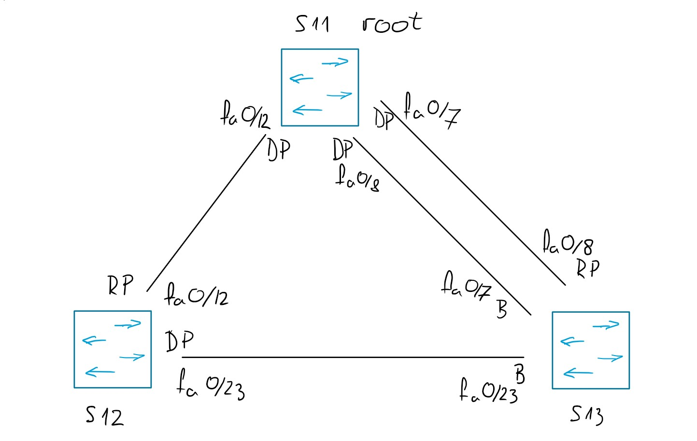

<h1 align="center">Notatki z sieci komputerowych</h1>

<h2 align="center"> Lab 2 </h2>

### 1. Wprowadzenie teoretyczne

Pętla jest problemem, bo ramki zaczynają krążyć i switch cały czas zaczyna przepisywać tablicę fdb, bo ustala ją na zasadzie ramek przychodzących. Kiedy raz ta ramka przychodzi mu z jednej raz z drugie strony, to cały czas zmienia tą tablicę.

root BID, ma 0 RP (root port)

BID - bridge ID
PID - port ID

jak ustalane są porty w spanning-tree:

- root: (priority (ustawiane przez administratora chyba), MAC)

- RP: min(koszt, sender BID, PID sender, PID receiver)

- DP: min(koszt, sender BID, PID sender, PID receiver)

ramki BPDU co 2s, jeśli nie dostanie ramki przez 20s, to z blocking przechodzi w listening.
Po 15s przechodzi w learning i potem znowu 15s i przechodzi w stan forwarding (dlatego czekamy 30s po podpieciu sie do switchy przed pingowaniem).

standard 802.1D koszty (taka tabelka gdzieś była, można tu wrzucić)

RSTP - rapid spanning tree (doczytać) 802.1w

autonegocjacja łącza 803.1u? (albo coś podobnie)

<figure align="center">
  
  <figcaption><em>Rys. 1 — Notatki z części teoretycznej (błąd w wyznaczaniu RP i DP sender receiver zamienione)</em></figcaption>
</figure>

### Część praktyczna

#### Ćwiczenie 2 (obserwacja zawartości ramek BPDU)

##### Kabelki

Podłączamy 3 komputery, każdy do innego switcha (kabelek niebieski, bez przeplotu)

<figure align="center">
  
  <figcaption><em>Rys. 2 — Podłączenie kabelków pt.1</em></figcaption>
</figure>

<figure align="center">
  
  <figcaption><em>Rys. 3 — Podłączenie kabelków pt.2</em></figcaption>
</figure>

Switche są spięte ze sobą białymi, komputery do switchy oraz konsolowe do switchy wpięte niebieskimi

##### Część komputerowa

Odpalamy wireshark na wszystkich 3 komputerach i szukamy najniższego adresu MAC (bo priority takie samo bo nie ustawialiśmy go) żeby ustalić jaki będzie root.
Potem połączenia oznaczamy według rozpiski z góry notatki.

Następnie spinamy komputery tak jak w zadaniu, odpalamy konsolę i sprawdzamy czy mieliśmy rację.

na każdym z komputerów:
putty -> console -> 2x enter -> no -> enable -> show spanning tree
i tutaj widać jak który port jest który

potem ustawiamy priority:
conf t -> spanning-tree vlan 1 priority xxxx

W S3 role RP pełni port o nizszym sender PID (u nas na rysunku ten co jest podpięty w S1 do fa0/7)

Chcemy zamieniać porty w S3 rolami:
na wszystkich komputerach odpalamy debug: enable -> debug spanning-tree events
na tym komputerze co jest tam root (u nas S1):
conf t -> int fa0/8(nr portu ktory zmieniamy) -> spanning-tree port priority xxxx
i ustawiamy te priorytety tak zeby zamienić porty rolami (niższy zostanie RP a wyższy będzie B)

<figure align="center">
  
  <figcaption><em>Rys. 4 — ustawianie priorytetów na portach</em></figcaption>
</figure>

<figure align="center">
  
  <figcaption><em>Schemat spanning tree z lab4</em></figcaption>
</figure>

nie zdążyliśmy zegarków zrobić (doczytaj i zrób notatke) i tak samo rozwalenie vlan
