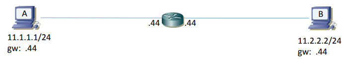
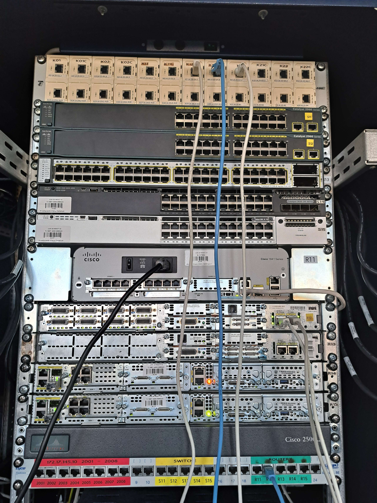
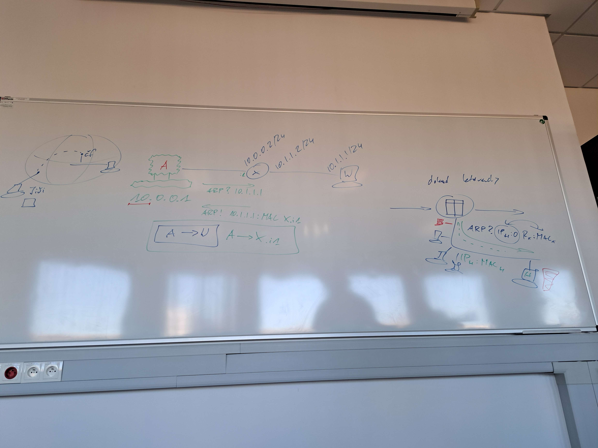

<h1 align="center">Notatki z sieci komputerowych</h1>

<h2 align="center"> Lab 5 (ARP) </h2>

### 1. Wprowadzenie teoretyczne

Sieci klasy a jest 2^24
Sieci klasy b jest 2^14
Klasa c 254
Router jak ma koniec trasy (podłączonego hosta)
to pyta Henia o adres MAC z użyciem ARP to Heniu odpowiada i daje IP:MAC (odwzorowanie IP na swój MAC)

Bierzemy ostatnie 2 routery, bo są prostsze i mają mniej portów

-   Po prawej port 0 po lewej port 1
-   Domyślnie port jest zamknięty

Mamy pokazać enkapsulację:

-   ramka od hosta do hosta, a od routera do hosta (tutaj coś)
-   obserwujemy ile bajtów ma pakiet na hoście docelowym
-   obserwujemy, który z portów routera jest wpisany w trasę przy ping -r

### Część praktyczna

1. Nadawanie adresów IP:

-   łączymy 2 komputery ze sobą (biały kabel - urządzenia tej samej klasy, tak samo jak router i komputer)
-   setip do ustawiania ip manualnie lub w ustawieniach windowsa
    Po wykonaniu polecenia ping na obu urządzeniach w wiresharku widać
-   później arp -a do oglądania tablicy arp
-   arp -d \* do usunięcia

2. Routery

-   łączymy komputery do routera białymi kablami
-   podpinamy któryś pc pod port konsolowy routera (niebieski kabel)
-   dwa enterki
-   polecenia do konfiguracji na upel
    Musimy ustawić w ustawieniach hostów adresy IP, maski i default gateaway.
    Później konfigurując router musimy na odpowiednich portach ustawić odpowiednie adresy bramy domyślnej. (Te same adresy co na komputerach)
-   jeżeli coś w windowsie nie działa, to resetujemy Ethernet (lub Ethernet 4) PPM, Disable, PPM, Enable
-   ping -n {liczba} {adres} wysyła daną liczbę pakietów
-   na warstwie 2 Src: Cisco Dst: MicroStar (od routera do hosta); na warstwie 3 Src: 11.1.1.1. Dst: 11.2.2.2 (od hosta do hosta)
-   do obserwacji fragmentacji pakietów zmniejszamy na jednym porcie MTU do 500
    Polecenia na Upelu
    Jak zmniejszymy Maximum Transmission Unit to ramka musi zostać podzielona i odpowiedź będzie w kawałkach - W Wiresharku fragmented reply.
    MTU - Maximum Transmission Unit - maksymalny rozmiar ramki, który może być przesłany przez dany interfejs sieciowy

### Polecenia do konfiguracji routera:

<figure align="center">
  
  <figcaption><em>Rys. 1 — Schemat podpięcia z interfejsami i adresami IP</em></figcaption>
</figure>

-   Konfiguracja interfejsu routera
    enable
    config t
    int fa0/0
    ip address 11.1.1.1 255.255.255.0
    no shutdown
    end
    show ip interface brief
    show arp
    show ip route

-   Ustawianie MTU na interfejsie
    enable
    config t
    int fa0/0
    ip mtu 500

<figure align="center">
  
  <figcaption><em>Rys. 2 — Podpięcie komputerów do routera</em></figcaption>
</figure>

<figure align="center">
  
  <figcaption><em>Rys. 3 — Notatki z tablicy lab5</em></figcaption>
</figure>
