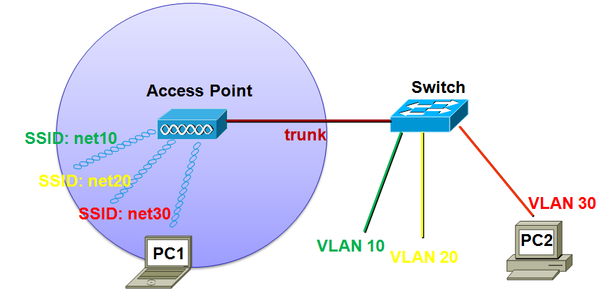

Zdjęcie tablicy po wstępie teoretycznym:


Najpierw resetujemy ten access point:
Trzymając wciśnięty przycisk MODE (na obudowie urządzenia) włącz zasilanie,
zwolnij przycisk MODE po zaświeceniu się diody STATUS na kolor ... hm... bursztynowy?

Ustawienia fabryczne urządzeń Cisco AiroNet 1200 to:

    SSID: tsunami
    ogłaszanie SSID: włączone (guest-mode),
    adres IP dla access pointa pobierany przez DHCP,
    jeśli się nie powiedzie, to ustawiany jest 10.0.0.1,
    nazwa użytkownika: Cisco
    hasło dostępu: Cisco
    hasło przejścia do trybu uprzywilejowanego: Cisco

Bezprzewodowy mostek podpinamy do prądu i kablem bez przeplotu (niebieskim) do konsoli komputera.

Jak już przywrócimy domyślne ustawienia, budujemy sieć bezprzewodową z użyciem access pointa.

ustawienie adresu IP na interfejsie BVI 1(Bridge Virtual Interface):

```bash
enable
configure terminal
interface bvi 1
  ip address 10.10.10.2 255.255.255.0
  no shutdown
exit
```

konfiguracja identyfikatora SSID sieci:

```bash
dot11 ssid KUBA17
  authentication open
  guest-mode
exit
```

włączenie interfejsu przewodowego i bezprzewodowego:

```bash
interface fa0
  no shutdown
exit
interface dot11radio0
  ssid KUBA17
  no shutdown
end
```

łączymy się np przez telefon
statycznie ustawiamy adres IP dla hosta (czyli tego telefonu co się nim podłączyliśmy)
Potem sprawdzamy poprzez ping z terminala konsoli z komputera czy się przechodzi

Chcemy skonfigurować kilka bezprzewodowych sieci na jednym access poincie.
Sieci te mają stanowić dopełnienie przewodowych VLANów obecnych w infrastrukturze, a zatem konieczne będzie skonfigurowanie łącza typu trunk pomiędzy access pointem, a switchem.

Rysunek poglądowy do zadania 2:


Zdjęcie okablowania:


Najpierw musimy poprawnie skonfugurować mostki logiczne na access poincie.

deklarujemy mostki:

```bash
enable
configure terminal
bridge irb
 bridge 10 protocol ieee
bridge 20 protocol ieee
bridge 30 protocol ieee
```

definiujemy sieci bezprzewodowe oraz przypisujemy je do interfejsu radiowego:

```bash
dot11 ssid net10
vlan 10
authentication open
guest-mode
exit

dot11 ssid net20
vlan 20
authentication open
! bez guest-mode !
exit

dot11 ssid net30
vlan 30
authentication open
! bez guest-mode !
exit

int dot11radio0
ssid net10
ssid net20
ssid net30
exit
```

ten access point może udostępniać na raz tylko 1 VLAN więc dlatego ustawiamy tylko na 1 guest mode

konfigurujemy logiczne podinterfejsy na interfejsach radiowym oraz fizycznym i przypisujemy je do zadeklarowanych mostków:

```bash
int dot11radio0.10
encapsulation dot1q 10
bridge-group 10
exit

int dot11radio0.20
encapsulation dot1q 20
bridge-group 20
exit

int dot11radio0.30
encapsulation dot1q 30
bridge-group 30
exit

int fa0.10
encapsulation dot1q 10
bridge-group 10
exit

int fa0.20
encapsulation dot1q 20
bridge-group 20
exit

int fa0.30
encapsulation dot1q 30
bridge-group 30
exit

int fa0
no shutdown
exit

int dot11radio0
no shutdown
exit

end
```

przy podpinaniu access pointa do switcha używamy kabla prostego (niebieskiego), przy podpinaniu access pointa do komputera też używamy kabla prostego (niebieskiego), bo access point ma 2 wejścia różnej klasy!!!

Przypisywanie portów switcha do VLANów:

```bash
enable
config t
interface range fa0/1 - 4  // czyli porty od 1 do 4 mają donależeć do vlanu 10
switchport mode access
switchport access vlan 10
exit
```

i takie powtarzamy dla vlanów 20 i 30 na portach 5-8 i 9-12 odpowiednio. (porty przykładowe, tak samo numery VLANów)

na końcu ustawiamy trunk na porcie switcha do którego podpięty jest access point:

```bash
enable
config t
switchport mode trunk
exit
```

No i na koniec można sprawdzić czy wszystko działa, podpinamy się do sieci bezprzewodowej z vlan 10 telefonem i ustawiamy IP. Potem pingujemy z terminala komputera podpiętego do portu switcha w vlanie 10.
