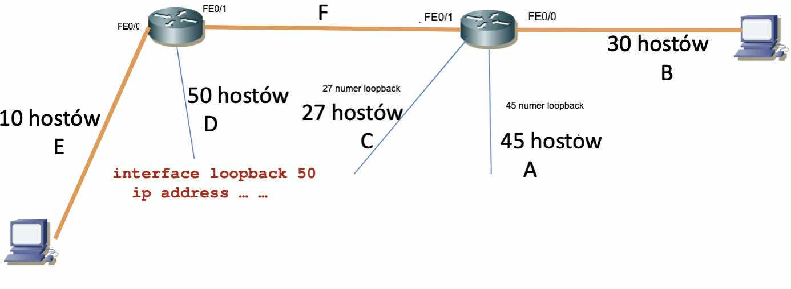
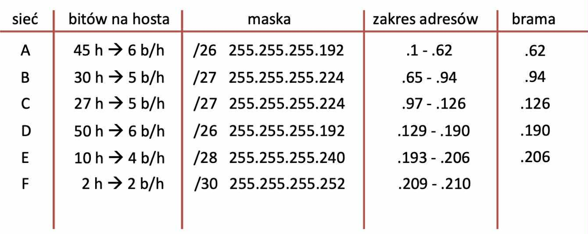

<h1 align="center">Notatki z sieci komputerowych</h1>

<h2 align="center"> Lab 8 (Routing statyczn, VLSM) </h2>

<!-- DODAĆ ZDJĘCIA TUTAJ, TUTAJ SCHEMAT PODŁĄCZENIA ROUTERA Z KOMPUTERAMI ITP + TUTAJ UZUPEŁNIĆ KOMENDY I OPISY ITP -->

### 1. Wprowadzenie teoretyczne

### Część praktyczna

Dwa zlaczone ze soba routery kablem z przeplotem i podlaczenie po hoscie do kazdego routera

### Polecenia do konfiguracji routera:

<figure align="center">
  
  <figcaption><em>Rys. 1 — Schemat podpięcia routerów</em></figcaption>
</figure>

<figure align="center">
  
  <figcaption><em>Rys. 2 — Tablica podziału sieci VLSM</em></figcaption>
</figure>

Ustawiamy na kazdym routerze jaka siec na jakim porcie

Konfiguracja interfejsu routera
enable
config t
int fa0/0
ip address 11.1.1.1 255.255.255.0
no shutdown
end
show ip interface brief
show ip route

"Wirtualne podsieci" ustawiamy za pomoca:
interface loopback 50
ip address … …

#### Nasze konfiguracje:

##### 1. router

-   siec E
    enable
    config t
    int fa0/0
    ip address 200.0.0.206 255.255.255.240
    no shutdown
    end
    show ip interface brief
    show ip route

-   siec D
    interface loopback 50
    ip address 200.0.0.190 255.255.255.192

##### 2. router

-   siec B
    enable
    config t
    int fa0/0
    ip address 200.0.0.94 255.255.255.224
    no shutdown
    end
    show ip interface brief
    show ip route

-   siec A
    interface loopback 45
    ip address 200.0.0.62 255.255.255.192

-   siec C
    interface loopback 27
    ip address 200.0.0.126 255.255.255.224

##### 3. Pomiedzy routerami

-   siec F

    -   na 1. routerze:
        enable
        config t
        int fa0/1
        ip address 200.0.0.210 255.255.255.252
        no shutdown
        end
        show ip interface brief
        show ip route

    -   na 2. routerze
        enable
        config t
        int fa0/1
        ip address 200.0.0.209 255.255.255.252
        no shutdown
        end
        show ip interface brief
        show ip route

###### Teraz trzeba wypelnic tablice routingu

Jak skonfigurować trasę statyczną:
enable
conf t
ip route <dokąd> <którędy>
ip route 13.3.3.0 255.255.255.0 12.2.2.2
end
show ip route
